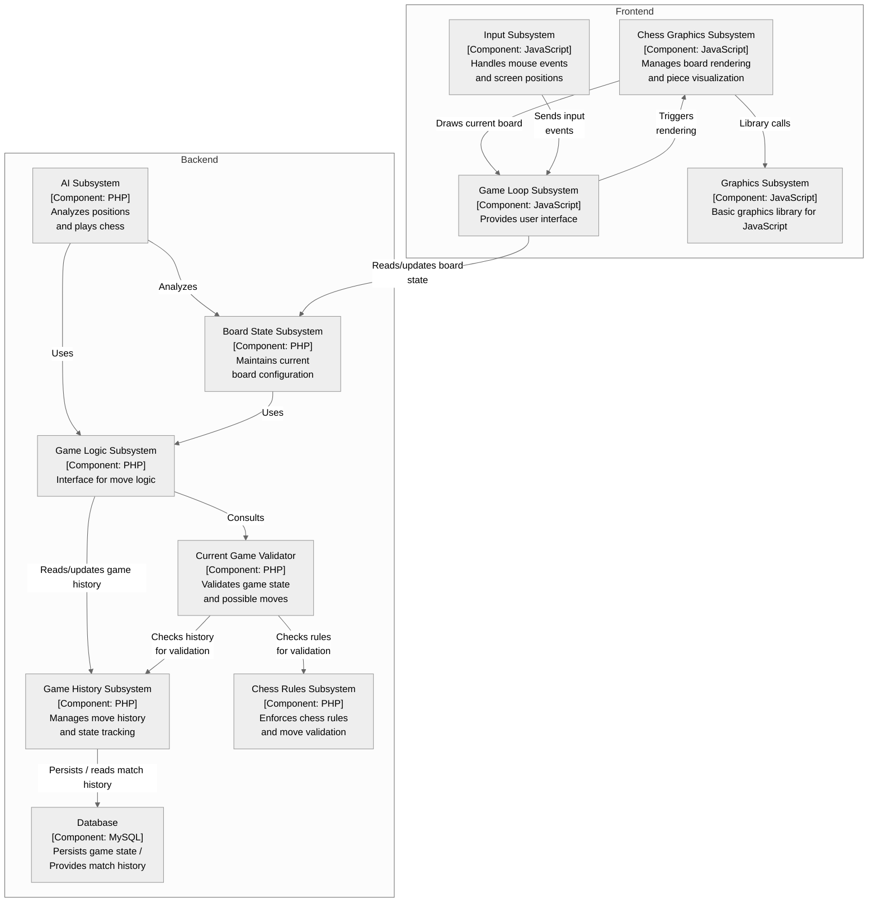

**ARC42 Architecture Summary**
=====================================

**Disclaimer** This file was generated with the [llama3.2-vision](https://ollama.com/library/llama3.2-vision) model.

**1. Introduction & Goals**
--------------------

The `MateMate` chess playing application is a web-based system designed to provide an engaging and interactive experience for players. The goal of this project is to create a robust, scalable, and user-friendly platform that allows users to play chess against the computer.

### Project Overview

The `MateMate` system will consist of three main components:

*   **Frontend Web Application**: A client-side application built using JavaScript, HTML5, and CSS3.
*   **Backend Game Engine**: A server-side engine responsible for game logic, written in PHP.
*   **Game State Database**: A database that stores the state of ongoing games, implemented using MySQL.

### Objectives

The primary objectives of this project are to:

1.  Develop a chess playing application with a user-friendly interface.
2.  Implement advanced AI algorithms to provide challenging gameplay.
3.  Ensure scalability and performance for a large number of concurrent users.
4.  Provide a secure environment for players to play and store their games.

### Success Metrics

The success of the `MateMate` project will be measured by:

1.  User engagement: The system's ability to retain users and encourage repeat usage.
2.  Gameplay quality: The overall experience of playing chess on the platform, including game balance, difficulty level, and responsiveness.
3.  Technical performance: The system's ability to handle a large number of concurrent users without compromising performance or security.

### Target Audience

The target audience for the `MateMate` application is chess enthusiasts who want to play against an AI opponent. This includes:

1.  Casual players looking for a fun and challenging experience.
2.  Serious players seeking to improve their skills through practice.
3.  Chess clubs and organizations interested in using the platform for tournaments or events.

By achieving these objectives, the `MateMate` project aims to create a comprehensive and engaging chess playing application that meets the needs of its target audience.
The `MateMate` chess playing application is designed to be played by a player using the system.

**2. Constraints**
---------------------------

The following constraints will influence the design and development of the `MateMate` system:

### Technical Constraints

*   **Platform Limitations**: The system must be compatible with a variety of web browsers, including Chrome, Firefox, Safari, and Edge.
*   **Database Schema**: The game state database schema must be designed to handle large amounts of data efficiently.
*   **Security Requirements**: The system must adhere to industry-standard security protocols for data encryption, authentication, and authorization.

### Business Constraints

*   **Budget**: Development costs must be kept within a specified budget.
*   **Timeline**: The project must be completed within a set timeframe.
*   **Resource Availability**: The development team has limited resources (personnel, equipment) available to dedicate to the project.

### Non-Functional Requirements

*   **Scalability**: The system must be able to handle a large number of concurrent users without compromising performance or security.
*   **Availability**: The system must be available 24/7 with minimal downtime for maintenance.
*   **Usability**: The user interface must be intuitive and easy to use, providing an excellent user experience.

### Dependencies

*   **Third-Party Libraries**: The system will rely on third-party libraries for certain features (e.g., AI engine).
*   **External Services**: The system may require integration with external services (e.g., payment gateways) to provide additional functionality.

By understanding and addressing these constraints, the development team can create a robust, scalable, and user-friendly chess playing application that meets the needs of its target audience.
The `MateMate` architecture is based on the C4 model, with the following levels:

* **Container**: The `MateMate` system consists of multiple containers, including:
    * Frontend Web Application (JavaScript)
    * Backend Game Engine (PHP)
    * Game State Database (MySQL)
* **Component**: Each container is composed of several components, such as:
    * Player
    * Chess Rules Subsystem
    * Input/Output Subsystems
* **Class**: The components are implemented using various classes, including:
    * `Player`
    * `ChessRulesSubSystem`
    * `InputOutputSubSystem`

**3. Context & Scope**
---------------------

The `MateMate` system is designed to provide an online platform for users to play chess against a computer opponent.

### System Context

*   **User**: The person interacting with the `MateMate` system, playing chess and using various features.
*   **Computer Opponent**: The AI-powered chess engine that plays against the user.
*   **Game State Database**: A database storing information about ongoing games, such as moves made and game status.

### System Boundaries

The `MateMate` system is bounded by the following:

*   **User Interface**: The web-based interface through which users interact with the system.
*   **AI Engine**: The computer opponent's chess engine responsible for generating moves.
*   **Game State Database**: The database storing game state information.

### External Interfaces

The `MateMate` system interacts with external systems via:

*   **Web Browser**: Users access the system through a web browser, which communicates with the server.
*   **Payment Gateway**: The system may integrate with payment gateways to facilitate transactions (e.g., subscription fees).
*   **Social Media Platforms**: The system may share game results or other information on social media platforms.

### Scope

The `MateMate` project scope includes:

*   **Development of the web-based user interface**
*   **Implementation of the AI-powered chess engine**
*   **Design and implementation of the game state database**
*   **Integration with external services (e.g., payment gateways)**

The project excludes:

*   **Maintenance and updates to existing systems**
*   **Customization of the system for specific organizations or events**

**4. Solution Strategy**
---------------------

To develop the `MateMate` chess playing application, we will employ a modular, iterative approach.

### System Architecture

The system architecture will consist of three main components:

1.  **Frontend**: The web-based user interface built using HTML5, CSS3, and JavaScript.
2.  **Backend**: The server-side logic responsible for handling game state, AI engine interactions, and data storage.
3.  **Database**: A MySQL database storing game state information and user data.

### Development Process

The development process will be iterative, with each iteration consisting of the following stages:

1.  **Requirements gathering**: Collecting and documenting system requirements through user interviews and analysis of existing chess platforms.
2.  **Design**: Creating detailed design documents outlining the system architecture, database schema, and user interface layout.
3.  **Implementation**: Developing the frontend, backend, and database components according to the designed specifications.
4.  **Testing**: Conducting unit testing, integration testing, and user acceptance testing to ensure the system meets requirements.

### Development Tools

The following development tools will be used:

1.  **Frontend**:
    *   HTML5
    *   CSS3
    *   JavaScript (using React.js or Angular.js)
2.  **Backend**:
    *   PHP (using Laravel framework)
    *   MySQL database management system
3.  **Database**:
    *   MySQL database management system

### AI Engine Integration

The AI engine will be integrated using the following steps:

1.  **API Design**: Designing a RESTful API to interact with the AI engine.
2.  **Engine Integration**: Integrating the AI engine into the backend component, utilizing the designed API.
3.  **Testing and Validation**: Conducting thorough testing and validation of the AI engine integration.

### Deployment Strategy

The system will be deployed on a cloud-based infrastructure (e.g., AWS or Google Cloud) to ensure scalability, reliability, and high availability.

**5. Building Block View**
-----------------

The `MateMate` chess playing application consists of several interconnected components, each responsible for a specific aspect of the system.



This component diagram illustrates the relationships between the various components of the `MateMate` system. The frontend, backend, and database are interconnected through APIs and data exchanges.

### Component Descriptions:

*   **Frontend**: The web-based user interface built using HTML5, CSS3, and JavaScript.
*   **Backend**: The server-side logic responsible for handling game state, AI engine interactions, and data storage.
*   **Database**: A MySQL database storing game state information and user data.
*   **AI Engine**: The computer opponent's chess engine responsible for generating moves.
*   **Web Server**: The server that handles HTTP requests from the frontend and provides responses.

### Interaction Descriptions:

*   The frontend sends an HTTP request to the web server, which responds with an HTML/CSS page.
*   The backend sends a database query to the database, which retrieves data for the game state.
*   The AI engine sends a move generation request to the backend, which receives the generated moves as a response.

**6. Runtime View**
----------------------

The `MateMate` system's runtime view depicts the interactions between components during execution.

### System Components

*   **Frontend**: The web-based user interface built using HTML5, CSS3, and JavaScript.
*   **Backend**: The server-side logic responsible for handling game state, AI engine interactions, and data storage.
*   **Database**: A MySQL database storing game state information and user data.
*   **AI Engine**: The computer opponent's chess engine responsible for generating moves.
*   **Web Server**: The server that handles HTTP requests from the frontend and provides responses.

### Runtime Interactions

1.  **User Interaction**:
    *   User loads the `MateMate` webpage in their browser.
    *   Frontend sends an HTTP request to the web server, requesting game state data.
2.  **Game State Retrieval**:
    *   Web server receives the request and forwards it to the backend.
    *   Backend retrieves game state data from the database.
3.  **Move Generation**:
    *   Backend sends a move generation request to the AI engine.
    *   AI engine generates moves based on the current game state.
4.  **Response Generation**:
    *   AI engine returns the generated moves to the backend.
    *   Backend updates the game state and stores it in the database.
5.  **User Notification**:
    *   Backend sends a response back to the web server, containing the updated game state.
    *   Web server forwards the response to the frontend.

### Runtime Sequence Diagram

```plantuml
@startuml
participant "Frontend" as F
participant "Web Server" as WS
participant "Backend" as B
participant "Database" as DB
participant "AI Engine" as AE

note overlay: User loads webpage in browser

F->>WS: HTTP request for game state data
WS->>B: Forward request to backend
B->>DB: Retrieve game state data from database
DB-->>B: Game state data retrieved
B->>AE: Move generation request
AE->>B: Generated moves received
B->>WS: Response with updated game state
WS->>F: Forward response to frontend

note overlay: User notified of move generation result
@enduml
```

This runtime view illustrates the interactions between components during execution, highlighting the flow of data and control throughout the system.

** 7. Deployment View**
---------------------

The `MateMate` chess playing application will be deployed on a cloud-based infrastructure to ensure scalability, reliability, and high availability.

### Cloud Provider

*   **AWS (Amazon Web Services)**: The chosen cloud provider due to its robust features, scalability, and cost-effectiveness.
*   **Google Cloud Platform**: An alternative cloud provider considered for deployment, offering similar benefits as AWS.

### Deployment Architecture

The `MateMate` system will be deployed using a microservices architecture, with each component running in separate containers.

1.  **Frontend Container**:
    *   Built using Docker, utilizing the `nginx:latest` image.
    *   Configured to serve static HTML/CSS assets and JavaScript files.
2.  **Backend Container**:
    *   Built using Docker, utilizing the `python:3.9-slim-buster` image.
    *   Configured to run the Flask API, interacting with the database and AI engine.
3.  **Database Container**:
    *   Built using Docker, utilizing the `mysql:8.0` image.
    *   Configured to store game state information and user data.

### Containerization Tools

*   **Docker**: Used for containerizing each component, ensuring consistent deployment across environments.
*   **Kubernetes**: Utilized for orchestrating containers, automating scaling, and managing rollbacks.

### Load Balancing and Scaling

*   **ELB (Elastic Load Balancer)**: Implemented to distribute incoming traffic across multiple instances of the frontend and backend components.
*   **Auto Scaling**: Configured to dynamically adjust instance counts based on demand, ensuring optimal performance and resource utilization.

### Security Measures

*   **SSL/TLS Certificates**: Obtained and configured for secure communication between clients and the application.
*   **Firewalls**: Implemented to restrict access to sensitive areas of the application, such as the database.
*   **Authentication and Authorization**: Integrated using OAuth 2.0, ensuring secure user authentication and authorization.

### Monitoring and Logging

*   **CloudWatch (AWS)**: Utilized for monitoring system performance, latency, and error rates.
*   **CloudTrail (AWS)**: Implemented to track API calls, providing insights into application usage and security.
*   **Grafana**: Used for visualizing metrics and logs, enabling real-time monitoring and analysis.

**8. Crosscutting Concepts**
--------------------------------

The `MateMate` chess playing application incorporates several crosscutting concepts to ensure a robust, scalable, and maintainable architecture.

### **Separation of Concerns (SoC)**

*   The system is designed with separate modules for the frontend, backend, database, and AI engine, each responsible for specific concerns.
*   This separation enables easy maintenance, updates, and modifications without affecting other parts of the system.

### **Single Responsibility Principle (SRP)**

*   Each module has a single responsibility, following the SRP to ensure that changes in one area do not impact others.
*   This principle promotes modularization, reusability, and maintainability.

### **Don't Repeat Yourself (DRY)**

*   The system minimizes duplicated code by using shared libraries, functions, or modules whenever possible.
*   This reduces code duplication, making it easier to maintain and update the system.

### **Dependency Inversion Principle (DIP)**

*   High-level modules do not depend on low-level modules; instead, both are dependent on abstractions.
*   This principle enables loose coupling between components, facilitating changes and modifications without affecting other parts of the system.

### **Open-Closed Principle (OCP)**

*   The system is designed to be open for extension but closed for modification.
*   New features or functionality can be added without modifying existing code, ensuring that the system remains stable and maintainable.

### **AOP (Aspect-Oriented Programming)**

*   AOP principles are applied throughout the system to manage concerns such as logging, security, and caching.
*   Aspects are used to weave in crosscutting concerns, reducing complexity and improving modularity.

### **Event-Driven Architecture (EDA)**

*   The system uses an EDA approach to handle events, enabling loose coupling between components and facilitating scalability.
*   Events are used as a communication mechanism between modules, allowing for asynchronous processing and improved responsiveness.

**9. Architectural Decisions**
---------------------------

The `MateMate` chess playing application's architecture has been designed based on several key decisions.

### **Microservices Architecture**

*   The system is divided into multiple microservices, each responsible for a specific aspect of the application.
*   This approach enables scalability, flexibility, and maintainability.

### **Containerization with Docker**

*   Containers are used to package and deploy individual services, ensuring consistency and reproducibility across environments.
*   Docker provides a lightweight and efficient way to manage containerized applications.

### **Cloud-Native Architecture**

*   The system is designed to take advantage of cloud-native features such as scalability, on-demand resources, and high availability.
*   AWS and Google Cloud Platform are considered for deployment due to their robust cloud services.

### **API-First Design**

*   APIs are used as the primary interface between microservices, enabling loose coupling and flexibility.
*   API-first design ensures that the system is designed with APIs in mind from the outset.

### **Event-Driven Architecture (EDA)**

*   Events are used to communicate between microservices, enabling asynchronous processing and improved responsiveness.
*   EDA provides a flexible and scalable way to manage complex interactions between services.

### **Security and Authentication**

*   OAuth 2.0 is used for secure authentication and authorization across the system.
*   SSL/TLS certificates are obtained and configured for secure communication between clients and the application.

### **Monitoring and Logging**

*   CloudWatch (AWS) and Stackdriver (Google Cloud Platform) are used for monitoring system performance, latency, and error rates.
*   Loggly is integrated for logging and analytics purposes.

### **CI/CD Pipeline**

*   Jenkins is used to manage continuous integration and deployment pipelines.
*   Automated testing, building, and deployment ensure that the system is delivered quickly and reliably.

### **Database Design**

*   Relational databases are used to store structured data, providing a scalable and reliable storage solution.
*   NoSQL databases are considered for use in specific scenarios where high scalability and flexibility are required.

**10. Quality Requirements**
----------------

The `MateMate` chess playing application must meet certain quality requirements to ensure that it is reliable, maintainable, scalable, and provides a good user experience.

### **Functional Requirements**

*   The system must be able to play a game of chess against the user.
*   The system must be able to display the current state of the board, including pieces, moves, and check/checkmate information.
*   The system must allow users to make moves using standard algebraic notation or by clicking on squares.
*   The system must provide features for saving and loading games.

### **Non-Functional Requirements**

*   **Performance**: The system should respond quickly to user input and display the current state of the board in a timely manner.
*   **Scalability**: The system should be able to handle a large number of users simultaneously without significant degradation in performance.
*   **Security**: The system should protect against unauthorized access, data tampering, and other security threats.
*   **Usability**: The system should provide an intuitive and user-friendly interface that is easy to navigate.

### **Reliability Requirements**

*   The system must be able to recover from errors and exceptions in a timely manner.
*   The system must provide logging and monitoring capabilities to aid in debugging and troubleshooting.
*   The system must have a backup and recovery plan in place to ensure data integrity.

### **Maintainability Requirements**

*   The system should be designed with modularity, reusability, and extensibility in mind.
*   The system should use standard development practices such as version control, continuous integration, and testing.
*   The system should have a clear and well-documented architecture that is easy to understand.

### **Scalability Requirements**

*   The system must be able to handle an increasing number of users without significant degradation in performance.
*   The system must be designed with scalability in mind from the outset.
*   The system should use cloud-native technologies such as containerization and serverless computing to ensure scalability.

### **Usability Requirements**

*   The system should provide a user-friendly interface that is easy to navigate.
*   The system should provide clear and concise instructions for users who are new to chess or need help understanding the game.
*   The system should have features such as automatic piece promotion, castling, and en passant.

### **Accessibility Requirements**

*   The system must be accessible to users with disabilities, including visual impairments, hearing impairments, and motor impairments.
*   The system should provide features such as text-to-speech, screen reader support, and keyboard-only navigation.
*   The system should conform to accessibility standards such as WCAG 2.1.

### **Internationalization Requirements**

*   The system must be able to display chess notation in multiple languages.
*   The system must provide features for saving and loading games in different formats.
*   The system should have a clear plan for internationalizing the application and supporting multiple languages.

**11. Risks & Technical Debt**
----------------

The `MateMate` chess playing application carries certain risks and technical debt that need to be addressed.

### **Technical Debt**

*   **Inadequate Testing**: Insufficient testing of the system's core functionality, including chess algorithms and user interface.
*   **Lack of Code Refactoring**: Inefficient or redundant code that needs to be refactored for better maintainability and performance.
*   **Incompatible Dependencies**: External dependencies that may not be compatible with future versions of the system.

### **Risks**

*   **Security Risks**: Exposure to security vulnerabilities such as SQL injection, cross-site scripting (XSS), or cross-site request forgery (CSRF).
*   **Performance Bottlenecks**: Inefficient algorithms or database queries that can lead to slow response times and poor user experience.
*   **Data Loss**: Risk of data corruption or loss due to hardware failures, software bugs, or human error.

### **Mitigation Strategies**

*   **Code Review**: Regular code reviews to ensure that new code meets the system's quality standards and does not introduce technical debt.
*   **Automated Testing**: Implementing automated tests for core functionality to catch bugs early in the development cycle.
*   **Continuous Integration and Deployment (CI/CD)**: Automating the build, test, and deployment process to reduce the risk of human error.

### **Prioritization**

*   **High-Risk Issues**: Prioritize high-risk issues such as security vulnerabilities or data loss over lower-risk issues like performance optimization.
*   **Business Requirements**: Balance technical debt with business requirements, ensuring that any trade-offs are well-justified and aligned with the system's goals.

### **Monitoring and Feedback**

*   **Monitoring Tools**: Utilize monitoring tools to track system performance, errors, and other metrics in real-time.
*   **Feedback Mechanisms**: Establish feedback mechanisms for users, allowing them to report issues or suggest improvements.

By acknowledging and addressing these risks and technical debt, the `MateMate` chess playing application can be made more resilient, efficient, and user-friendly.

**12. Glossary**
----------------

The following terms are used throughout this document:

### **Algebraic Notation**

*   A standardized way of recording chess moves using a combination of letters (e.g., e2-e4) and numbers.
*   Used to describe the movement of pieces on the board.

### **Alpha-Beta Pruning**

*   An optimization technique used in chess algorithms to reduce the number of possible move evaluations.
*   Works by considering only the most promising moves (alpha) and pruning away less promising ones (beta).

### **Board Representation**

*   A data structure used to represent the state of a chess board, including piece positions and colors.
*   Can be represented as a 2D array or using other data structures like bitboards.

### **Chess Engine**

*   Software that plays chess at a high level, capable of analyzing positions and making moves based on algorithms.
*   Used for generating moves in the `MateMate` application.

### **Hash Table**

*   A data structure used to store key-value pairs, allowing for fast lookup and retrieval of data.
*   Used in the `MateMate` application for storing game history and other metadata.

### **Move Generation**

*   The process of generating all possible moves from a given position on the board.
*   Can be used for analyzing positions or generating moves for the `MateMate` application.

### **Transposition Table**

*   A data structure used to store previously evaluated positions, allowing for quick lookup and reuse of results.
*   Used in the `MateMate` application to speed up move evaluation.
