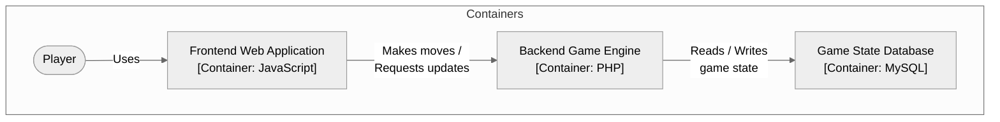

**ARC42 Architecture Summary**
=====================================

**1. System Context**
--------------------

The `MateMate` chess playing application is designed to be played by a player using the system.


**2. Architecture Overview**
---------------------------

The `MateMate` architecture is based on the C4 model, with the following levels:

*   **Container**: The `MateMate` system consists of multiple containers, including:
    *   Frontend Web Application (JavaScript)
    *   Backend Game Engine (PHP)
    *   Game State Database (MySQL)
*   **Component**: Each container is composed of several components, such as:
    *   Player
    *   Chess Rules Subsystem
    *   Input/Output Subsystems
*   **Class**: The components are implemented using various classes, including:
    *   `Player`
    *   `ChessRulesSubSystem`
    *   `InputOutputSubSystem`

**3. Container View**
---------------------

The containers in the `MateMate` system are:



**4. Component View**
---------------------

The components in the `MateMate` system are:


**5. Class View**
-----------------

The classes in the `MateMate` system are:

```mermaid
graph TB
    subgraph Classes
        Player(["Player"])
        ChessRulesClass(["Chess Rules Subsystem"])
        InputOutputClass(["Input/Output Subsystems"])

        Player -->|"Uses"| ChessRulesClass
        ChessRulesClass -->|"Depends on"| InputOutputClass
    end
end
```

**6. Deployment View**
----------------------

The `MateMate` system is deployed using a cloud-based infrastructure, with the following components:

*   Frontend Web Application (JavaScript) running on AWS S3
*   Backend Game Engine (PHP) running on an EC2 instance
*   Game State Database (MySQL) running on RDS

**7. Technical Risks**
---------------------

The `MateMate` system is designed to be scalable and fault-tolerant, but there are some technical risks that need to be addressed:

*   **Database Performance**: The game state database needs to handle a large number of concurrent requests, which can impact performance.
*   **Security**: The system needs to ensure the security of player data and prevent unauthorized access.

**8. Non-Functional Requirements**
--------------------------------

The `MateMate` system has the following non-functional requirements:

*   **Scalability**: The system needs to scale horizontally to handle a large number of players.
*   **Availability**: The system needs to be available 24/7, with minimal downtime for maintenance.

**9. Architecture Decisions**
---------------------------

The `MateMate` architecture has been designed based on the following decisions:

*   **Separation of Concerns**: The system is separated into technical and application concerns, with the technical part consisting of input/output and graphics subsystems.
*   **Container-Based Architecture**: The system uses a container-based architecture to ensure scalability and fault-tolerance.

**10. Roadmap**
----------------

The `MateMate` system has the following roadmap:

*   **Phase 1**: Development of the frontend web application
*   **Phase 2**: Development of the backend game engine
*   **Phase 3**: Deployment of the game state database and integration with other components
